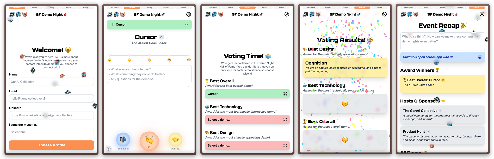

# Demo Night App 🧬

**The [Demo Night App (DNA)](https://demos.aicollective.com) is an open-source, community-led project we use to maximize value for all involved at our flagship demo night events!**



<a href="https://www.loom.com/share/20bb08ab431040cf878a8a654860efab">
  
</a>

## 🚀 What is Demo Night?

_An evening of live demos and collaboration with the innovators shaping tomorrow_. Here's an [example event](https://lu.ma/demo-night)!

## 🧑‍💻 Contributing

If you'd like to contribute to this community project, check out our [issues](https://github.com/the-ai-collective/demo-night-app/issues) to find tasks you can help with!

Feel free to reach out to us at [engineering@aicollective.com](mailto:engineering@aicollective.com)! 😄

## ⚙️ Getting Started

### 1. Install the packages

```bash
yarn install
yarn global add dotenv-cli
```

### 2. Set up environment variables

For `.env` key/value pairs, see `.env.example`.

### 3. Start the local DB Docker Compose service

```bash
./start-database.sh
```

### 4. Push the schema and seed the local DB with a "<test@example.com>" example account and test event

```bash
yarn db:push
yarn db:seed
```

### 5. Start the development server

```bash
yarn dev
```

- The local app should now be available at `localhost:3000` and `localhost:3000/admin`!
- You can log in with "<test@example.com>"

## 📊 Data Ops

### Dev Data Studio

To manipulate the data and relations directly via Prisma during local development:

```bash
yarn db:studio
```

### Migration

To alter the data schema (adding/removing/editing columns, changing unique/compound/primary keys, etc.), make changes in `schema.prisma` file, save, and run:

```bash
yarn db:migrate
```

- Fixing failed migrations:
  <https://www.prisma.io/docs/orm/prisma-migrate/workflows/patching-and-hotfixing>
